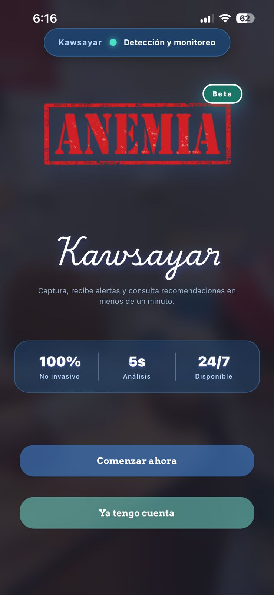
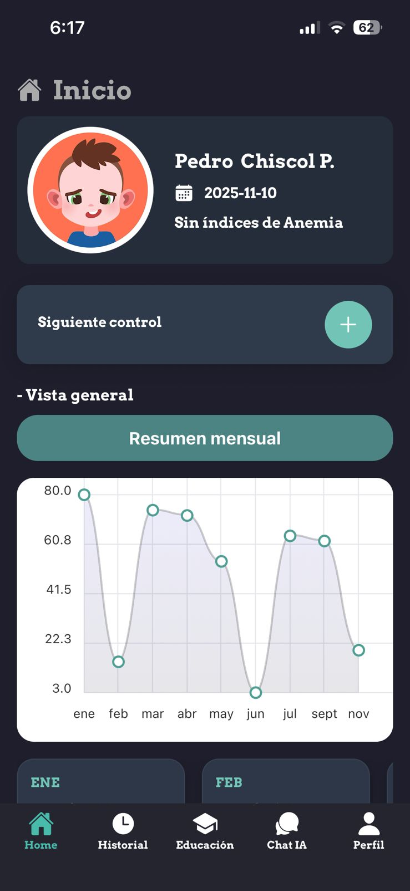
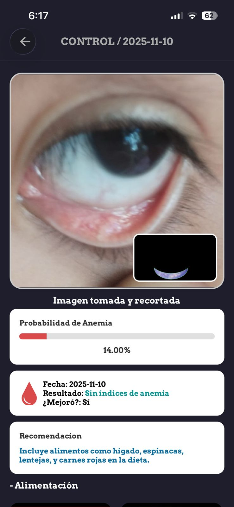
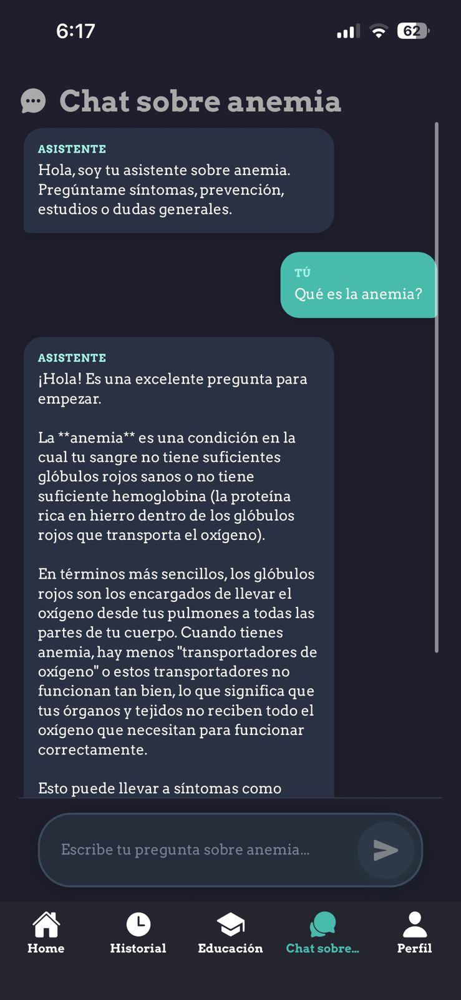

# SACN - Sistema de Detección de Anemia

<div align="center">


Una aplicación móvil inteligente para la detección no invasiva de anemia mediante análisis de imágenes con IA

[🇬🇧 English](./README.md) | [Características](#características) | [Instalación](#instalación) | [Uso](#uso)


</div>

---

## Tabla de Contenidos

- [Acerca de](#acerca-de)
- [Características](#características)
- [Stack Tecnológico](#stack-tecnológico)
- [Prerequisitos](#prerequisitos)
- [Instalación](#instalación)
- [Configuración](#configuración)
- [Uso](#uso)
- [Estructura del Proyecto](#estructura-del-proyecto)
- [Integración de API](#integración-de-api)
- [Contribuir](#contribuir)
- [Licencia](#licencia)

## Acerca de

SACN (Sistema de Detección de Anemia) es una aplicación móvil de vanguardia que aprovecha la inteligencia artificial y la visión por computadora para detectar anemia mediante el análisis de imágenes conjuntivales. La aplicación proporciona un método rápido, no invasivo y accesible para el cribado preliminar de anemia, haciendo la atención médica más accesible para todos.

### ¿Por qué SACN?

- No invasivo: No se requieren análisis de sangre
- Resultados rápidos: Obtén predicciones en segundos
- Mobile-first: Disponible en cualquier lugar, en cualquier momento
- Potenciado por IA: Utiliza aprendizaje automático para detección precisa
- Seguimiento: Monitorea el progreso de salud a lo largo del tiempo
- Multi-Perfil: Gestiona múltiples miembros de la familia

## Características

### Funcionalidad Principal
- Autenticación segura: Registro de usuario, inicio de sesión y recuperación de contraseña
- Captura de imagen: Captura de imágenes conjuntivales de alta calidad con guía
- Detección con IA: Predicción de anemia basada en aprendizaje automático
- Recorte inteligente: Extracción automática de la región de interés
- Visualización de resultados: Gráficos interactivos e indicadores de nivel de anemia

### Experiencia de Usuario
- Gestión de perfiles: Crea y administra múltiples perfiles de usuario
- Historial médico: Rastrea todos los exámenes de anemia a lo largo del tiempo
- Exportación a PDF: Genera informes médicos profesionales
- Chatbot con IA: Asistente educativo para preguntas relacionadas con la anemia
- Contenido educativo: Recursos en video sobre prevención y tratamiento de anemia
- Soporte de temas: Modo oscuro y claro

### Monitoreo de Salud
- Seguimiento de progreso: Visualiza tendencias de hemoglobina a lo largo del tiempo
- Recomendaciones personalizadas: Obtén consejos de salud adaptados
- Notificaciones: Recordatorios para chequeos regulares

## Stack Tecnológico

### Frontend
- Framework: [React Native](https://reactnative.dev/) (0.81.4)
- Plataforma: [Expo](https://expo.dev/) (~54.0)
- Lenguaje: TypeScript (5.x)
- Navegación: Expo Router (enrutamiento basado en archivos)
- Componentes UI: Componentes temáticos personalizados
- Gráficos: react-native-chart-kit
- Animaciones: react-native-reanimated, react-native-animatable

### Librerías Clave
- @react-native-picker/picker: Selección de fecha y opciones
- expo-image-picker: Integración de cámara y galería
- expo-image-manipulator: Procesamiento de imágenes
- expo-print: Generación de PDF
- react-native-view-shot: Captura de pantalla
- moment: Manipulación de fechas
- @google/genai: Integración de chatbot con IA

### Integración Backend
- Comunicación con API RESTful
- Carga de imágenes con multipart/form-data
- Autenticación JWT (si aplica)

## Prerequisitos

Antes de comenzar, asegúrate de tener instalado lo siguiente:

- Node.js: v18 o superior ([Descargar](https://nodejs.org/))
- npm o yarn: Gestor de paquetes
- Expo CLI: Instalar globalmente
  ```bash
  npm install -g expo-cli
  ```
- App Expo Go: Instalar en tu dispositivo móvil ([iOS](https://apps.apple.com/app/expo-go/id982107779) | [Android](https://play.google.com/store/apps/details?id=host.exp.exponent))
- Servidor Backend: API backend de SACN en ejecución (ver [Integración de API](#integración-de-api))

### Opcional (para compilaciones nativas)
- Android Studio: Para desarrollo en Android
- Xcode: Para desarrollo en iOS (solo macOS)

## Instalación

### 1. Clonar el Repositorio

```bash
git clone <url-del-repositorio>
cd SACN-TESIS-FRONTEND
```

### 2. Instalar Dependencias

```bash
npm install
```

o usando yarn:

```bash
yarn install
```

### 3. Configurar el Entorno

Crea tu archivo de configuración de API:

```bash
cp apis/apis.example.tsx apis/apis.tsx
```

Edita `apis/apis.tsx` y establece la IP de tu servidor backend:

```typescript
const ip = "TU_IP_BACKEND"; // ej: "192.168.1.100" o "api.tuservidor.com"
```

## Configuración

### Endpoints de la API

La aplicación se comunica con los siguientes servicios backend:

- /users/register - Registro de usuario
- /users/login - Autenticación de usuario
- /users/forgot_password_recuperar - Recuperación de contraseña
- /predict/ - Predicción de anemia
- /validate/validate - Validación de imagen conjuntival
- /profiles/* - Gestión de perfiles
- /crop/crop - Recorte de imagen

### Variables de Entorno

Para compilaciones de producción, considera usar variables de entorno:

```bash
# .env (añade esto a .gitignore)
API_BASE_URL=http://tu-url-api.com
API_PORT=3000
```

## Uso

### Modo de Desarrollo

Inicia el servidor de desarrollo de Expo:

```bash
npm start
```

o

```bash
npx expo start
```

### Ejecutar en Dispositivos

Opción 1: Expo Go (Más Fácil)
1. Abre la aplicación Expo Go en tu dispositivo
2. Escanea el código QR desde la terminal
3. La aplicación se cargará automáticamente

Opción 2: Emulador de Android
```bash
npm run android
```

Opción 3: Simulador de iOS (solo macOS)
```bash
npm run ios
```

Opción 4: Navegador Web
```bash
npm run web
```

### Compilar para Producción

Crea una compilación de producción:

```bash
expo build:android
expo build:ios
```

Para la moderna herramienta EAS Build:

```bash
eas build --platform android
eas build --platform ios
```

## Estructura del Proyecto

SACN-TESIS-FRONTEND/
├── app/                          # Pantallas principales de la aplicación
│   ├── _layout.tsx                  # Layout raíz con navegación
│   ├── index.tsx                    # Pantalla de inicio/splash
│   ├── Login.tsx                    # Pantalla de autenticación
│   ├── Registrer.tsx                # Registro de usuario
│   ├── profiles.tsx                 # Selección de perfil
│   ├── prediction.tsx               # Captura de imagen y predicción
│   ├── result.tsx                   # Resultados de predicción
│   ├── detalle.tsx                  # Detalles del resultado
│   ├── AppContext.tsx               # Gestión de estado global
│   └── (tabs)/                      # Pantallas de navegación por pestañas
│       ├── homeScreen.tsx           # Panel de control
│       ├── historial.tsx            # Historial médico
│       ├── chatbot.tsx              # Asistente con IA
│       ├── education.tsx            # Contenido educativo
│       └── perfil.tsx               # Perfil de usuario
│
├── apis/                         # Integración de API backend
│   └── apis.tsx                     # Funciones de servicio de API
│
├── components/                   # Componentes reutilizables
│   ├── Button.tsx                   # Componente de botón personalizado
│   ├── FormInput.tsx                # Componente de campo de entrada
│   ├── DateInput.tsx                # Componente de selector de fecha
│   ├── SelectedInput.tsx            # Componente de menú desplegable
│   ├── AnemiaChart.tsx              # Visualización de gráficos
│   ├── ExportToPDF.tsx              # Generación de PDF
│   ├── ProgressBar.tsx              # Indicador de progreso
│   ├── Videos.tsx                   # Reproductor de video
│   ├── Camara/                      # Componentes de cámara
│   │   ├── ImagePickerButton.tsx
│   │   └── DraggableImage.tsx
│   ├── Modals/                      # Diálogos modales
│   │   ├── CustomModal.tsx
│   │   ├── ModalForms.tsx
│   │   ├── ModalProfiles.tsx
│   │   └── RecommendationOverlay.tsx
│   └── ui/                          # Utilidades de UI
│
├── styles/                       # Estilos específicos de pantalla
├── constants/                    # Constantes y temas de la app
├── hooks/                        # Hooks personalizados de React
├── lib/                          # Librerías de utilidades
├── assets/                       # Imágenes, fuentes, íconos
└── Archivos de configuración
    ├── package.json
    ├── tsconfig.json
    ├── app.json
    └── eslint.config.js

## Integración de API

### Requisitos del Backend

Esta aplicación frontend requiere que el servidor backend de SACN esté en ejecución. El backend debe proporcionar:

1. API de Autenticación de Usuario
   - Registro con verificación de correo electrónico
   - Inicio/Cierre de sesión
   - Recuperación de contraseña

2. API de Predicción
   - Validación de imagen (¿es una imagen conjuntival válida?)
   - Predicción de anemia usando modelo ML
   - Almacenamiento de controles/exámenes

3. API de Gestión de Perfiles
   - Crear, leer, actualizar, eliminar perfiles de usuario
   - Recuperar datos históricos por perfil

4. API de Procesamiento de Imágenes
   - Recorte automático de la región de interés
   - Preprocesamiento de imágenes

### Ejemplo de Configuración del Backend

Asegúrate de que tu backend esté en ejecución y accesible:

```bash
# El backend debe estar ejecutándose en:
http://<TU_IP>:3000
```

## Contribuir

¡Las contribuciones son bienvenidas! Por favor, sigue estos pasos:

1. Haz un fork del repositorio
2. Crea una rama de característica (`git checkout -b feature/CaracteristicaIncreible`)
3. Confirma tus cambios (`git commit -m 'Agregar alguna CaracteristicaIncreible'`)
4. Empuja a la rama (`git push origin feature/CaracteristicaIncreible`)
5. Abre un Pull Request

### Guías de Desarrollo

- Sigue las mejores prácticas de TypeScript
- Usa nombres significativos para componentes y variables
- Agrega comentarios para lógica compleja
- Prueba en iOS y Android
- Actualiza la documentación cuando sea necesario

## Licencia

Este proyecto está licenciado bajo la Licencia MIT - consulta el archivo LICENSE para más detalles.

## Autores

Juan Chiscol - Proyecto de Tesis

## Soporte

Para preguntas, problemas o sugerencias:

Email: chiscolpatazcajuandavid@gmail.com

## Fotos del Proyecto

A continuación algunas capturas de pantalla de la app SACN:

<div align="center">







</div>
